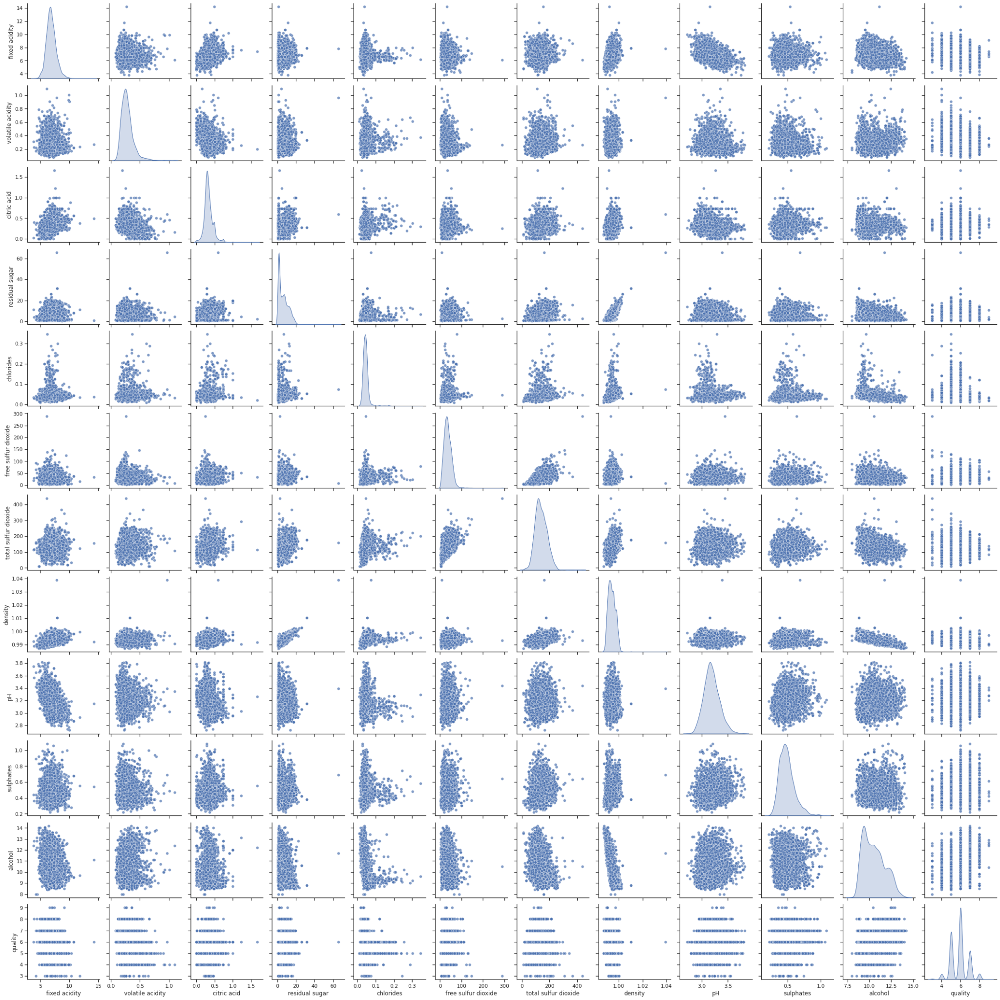
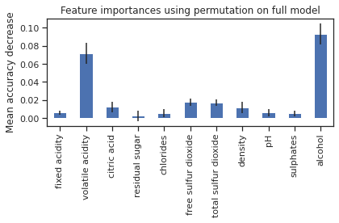

**Analysis of White Wine Data Using Random Forest Classifier**

The white wine dataset from the UCI Machine Learning Repository contains chemical and sensory characteristics of 4,898 white wines, along with a quality rating (0-10) for each wine. The goal of this analysis is to build a model that can predict whether a white wine has a quality rating of more than 6 or less than 6 based on its chemical and sensory characteristics.

**Model Comparison**

The first step in the analysis was to observe the data set and features and compare the performance of different models on the data. The following models were evaluated:

* Logistic regression

* LinearSVC

* Decision tree

* Random forest

* XGBClassifier

The models were trained on data using 5-fold cross-validation to evaluate and compare their performance with other models. The results showed that the random forest classifier yielded the highest accuracy, with an average accuracy of 83.9% on the test set. Therefore, the random forest classifier was chosen as the model for this analysis.

Fig 1. Pair grid of all features of the dataset

Table 1. Average Accuracy Score after 5-fold cross-validation

<table>
  <tr>
    <td></td>
    <td>Average Accuracy Score </td>
  </tr>
  <tr>
    <td>Logistic regression</td>
    <td>0.743774572137333</td>
  </tr>
  <tr>
    <td>LinearSVC</td>
    <td>0.542472535490192</td>
  </tr>
  <tr>
    <td>Decision tree</td>
    <td>0.7799093202142962</td>
  </tr>
  <tr>
    <td>Random forest</td>
    <td>0.836871860082133</td>
  </tr>
  <tr>
    <td>XGBClassifier</td>
    <td>0.7782789602051239</td>
  </tr>
</table>

**Feature Engineering**

To improve the performance of the model, feature engineering was performed to identify the most important features and eliminate less important features.

The importance of each feature was calculated using the *permutation_importances_ *attribute of the random forest classifier with 10 permutations. Features with an importance of less than 5% were eliminated from the dataset which, in this case, is the "residual sugar".

After performing feature engineering, the model was trained on the modified dataset. The model achieved an accuracy of 84.47% on the test set, an improvement of 1.22% relative to the initial model with an accuracy of 83.45%.

Fig 2. Feature importances using permutation importances

**Hyperparameter Tuning**

To further improve the performance of the model, the hyperparameters of the random forest classifier were fine-tuned using the RandomSearchCV and GridSearchCV functions from the sklearn.model_selection module.

First, a range of hyperparameter values was defined and a random search was performed using the RandomSearchCV function. This helped to identify a good range of values for the hyperparameters.

Next, a grid search was performed using the GridSearchCV function to fine-tune the hyperparameters within the defined range. The best performing combination of hyperparameters was selected based on the mean cross-validated score. The final model achieved an accuracy of 84.78% on the test set, an improvement of 0.36% relative to the initial model.

Hence, the final random forest classifier model achieved an accuracy of 84.78%, a precision of 87.24%, a recall score of 90.56%, and an f1 score of 88.87%. 

**Conclusion**

The results of this analysis demonstrate the potential for using a random forest classifier to predict the quality of white wines based on their chemical and sensory characteristics. Performing feature engineering and fine-tuning the hyperparameters of the model using RandomSearchCV and GridSearchCV were effective in improving the performance of the model.

In future work, it would be interesting to explore other modeling techniques and see if they can improve the model's performance. It would also be useful to gather more data on white wines to further validate the model and explore any additional relationships between the variables. It would be interesting to classify the quality value itself from 0 to 10 rather than using a binary classifier.

Overall, this analysis shows that using the random forest classifier can achieve higher accuracy up to 84.78%, an improvement of 13% over the experiment conducted by a colleague that uses logistic regression as a binary classification.

**Citations**

"Hyperparameter Tuning the Random Forest in Python | by Will Koehrsen." *Towards Data Science*, 10 January 2018, https://towardsdatascience.com/hyperparameter-tuning-the-random-forest-in-python-using-scikit-learn-28d2aa77dd74. Accessed 10 January 2023.

"Improving the Random Forest in Python Part 1 | by Will Koehrsen." *Towards Data Science*, 6 January 2018, https://towardsdatascience.com/improving-random-forest-in-python-part-1-893916666cd. Accessed 10 January 2023.

